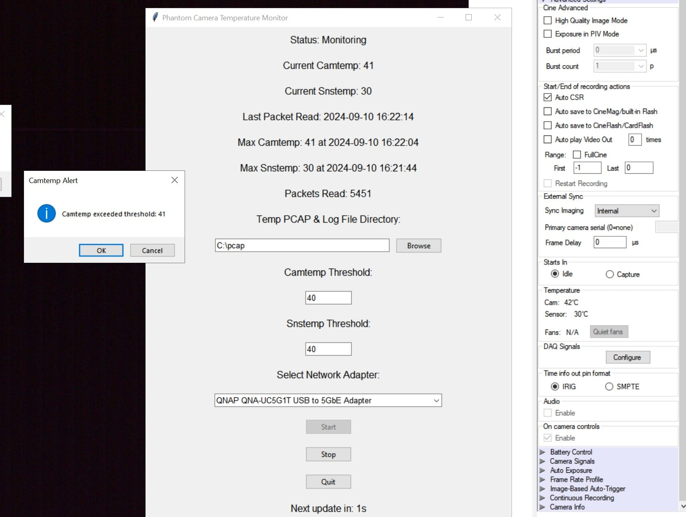

# PhantMon
PhantMon Python application that monitors the temperature of Phantom cameras by capturing network traffic and analyzing temperature data. The application provides a graphical user interface (GUI) to display real-time temperature readings and alerts the user if the temperature exceeds specified thresholds. This can help to prevent camera overheating and corruption of data. The program generates a log file of camera body and sensor temperatures. 

## Features

- Capture network traffic from a specified network adapter.
- Analyze captured packets to extract camera and sensor temperature data every 10 seconds.
- Display real-time temperature readings in a GUI.
- Set thresholds for camera and sensor temperatures.
- Send desktop notifications if temperature thresholds are exceeded.
- Log temperature data to a CSV file.

## Python Requirements
- Python 3
- Scapy and Tkinter (these can be installed by running "pip install -r requirements.txt"

## Network Requirements
- Direct network connection between system running script and Phantom Research camera that uses port 7115 as source

## Usage

Use the GUI to:
    - Select a network adapter.
    - Set temperature thresholds.
    - Start and stop monitoring.
    - Browse and set the log file location.

